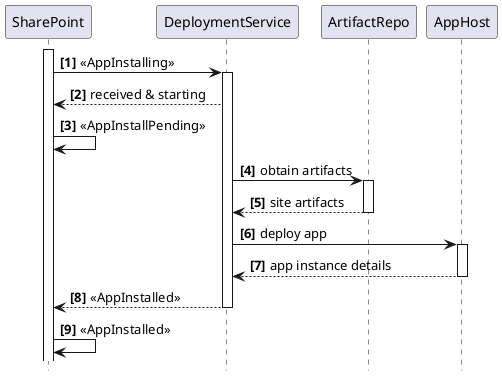

# Plant UML

## Easily create beautiful UML Diagrams

---

- **Sequence Diagrams**

- **Drawing Usacases**

- **Using PlantUML inside markdowns**

---

```plantuml
@startuml
hide footbox
autonumber "<b>[0]"
participant SharePoint
participant DeploymentService
participant ArtifactRepo
participant AppHost

activate SharePoint
SharePoint -> DeploymentService: << AppInstalling >>
activate DeploymentService
SharePoint <-- DeploymentService: received & starting
SharePoint -> SharePoint: << AppInstallPending >>

DeploymentService -> ArtifactRepo: obtain artifacts
activate ArtifactRepo
DeploymentService <-- ArtifactRepo: site artifacts
deactivate ArtifactRepo

DeploymentService -> AppHost: deploy app
activate AppHost
DeploymentService <-- AppHost: app instance details
deactivate AppHost

SharePoint <-- DeploymentService: << AppInstalled >>
deactivate DeploymentService
SharePoint -> SharePoint: << AppInstalled >>

@enduml
```
