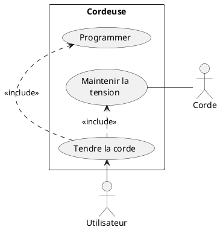

# Use Case Diagram

---

```plantuml
@startuml
actor Utilisateur
actor Corde
left to right direction
skinparam packageStyle rect
rectangle Cordeuse {
'-------------------------------'
Utilisateur -> (Tendre la corde)
(Tendre la corde) .> (Programmer) : <<include>>
(Tendre la corde) .> (Maintenir la\ntension) : <<include>>
(Maintenir la\ntension) -- Corde <<actor>>
}

@enduml
```
