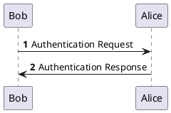

# Using PlantUML inside markdowns


```uml

``` plantuml
@startuml
    autonumber
    Bob -> Alice : Authentication Request
    Bob <- Alice : Authentication Response
@enduml
``` .
```


```plantuml
@startuml
    autonumber
    Bob -> Alice : Authentication Request
    Bob <- Alice : Authentication Response
@enduml
```