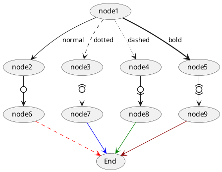
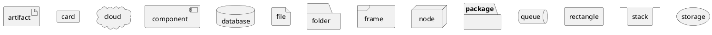

# PlantUML Cheatsheet

## Sequence Diagram

### shapes

### lines

### arrows

### notes

## Usecase Diagram

## shapes

## lines

```uml
@startuml
(node1) --> (node2) : normal
(node1) ..> (node3) : dotted
(node1) ~~> (node4) : dashed
(node1) ==> (node5) : bold

(node2) -0-> (node6)
(node3) -(0-> (node7)
(node4) -0)-> (node8)
(node5) -(0)-> (node9)

(node6) .[#red].> (End)
(node7) -[#blue]-> (End)
(node8) -[#green]-> (End)
(node9) -[#DarkRed]-> (End)
@enduml
```



## arrows

## notes

## containers

```uml
@startuml
artifact artifact {
}
card card {
}
cloud cloud {
}
component component {
}
database database {
}
file file {
}
folder folder {
}
frame frame {
}
node node {
}
package package {
}
queue queue {
}
rectangle rectangle {
}
stack stack {
}
storage storage {
}
@enduml
```


